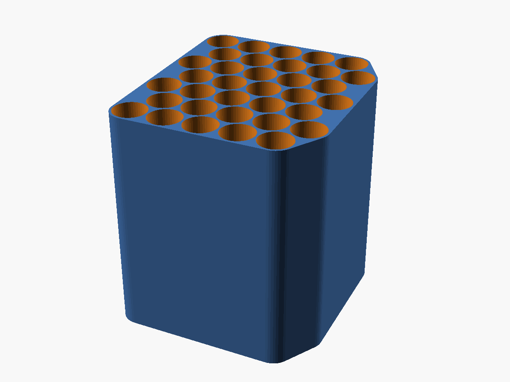

# 100× 3 mL Vial Freezer Container — Near-Cube Honeycomb

The smallest practical 3D-printable container for **100 lyophilized 3 mL vials**, optimized to be compact in *all three* dimensions (near-cube, not a flat tray).



## Specs

| | |
|---|---|
| **Vial** | Ø16.51 × 37.74 mm (standard 3 mL serum vial) |
| **Capacity** | 105 cells (100 vials + 5 spare) |
| **Layout** | 5 × 7 hexagonal grid × 3 vials deep |
| **Envelope** | **101 × 114 × 115 mm** (aspect 1.13 — near-cube) |
| **Walls** | 1.2 mm (outer + interstitial), 2 mm floor |
| **Packing** | hexagonal close-pack; ~1.3 L bounding for ~0.8 L of glass |

The volume floor for 100 of these vials is ~0.9 L (infinite hex packing); this finite, walled, near-cube lands at ~1.3 L — about as compact as a *usable* hex container gets without going to a 35 cm flat slab.

## Files

| File | Purpose |
|---|---|
| `vial_cube.stl` | **Print this** (binary STL) |
| `vial_cube.scad` | Parametric source — change vial size, grid, walls |
| `cutaway_part.scad` | Renders the cutaway view |
| `pack.py` | Packing optimizer (why 5×7×3 is the near-cube) |
| `iso.png` / `top.png` / `cutaway.png` | Renders |

## Printing

- **Orientation:** print standing up — the bores run vertical (Z), so **no supports** inside the cells.
- **Material:** PETG or PLA (it's a fixture, not wetted). Cold/freezer-safe: PETG preferred.
- **Walls** are 1.2 mm → use a 0.4 mm nozzle, 3 perimeters.
- Vials drop into each cell, stacked 3 deep; load/unload from the open top.

## Tuning

Edit the parameters at the top of `vial_cube.scad` and re-render:

```bash
openscad -o vial_cube.stl --export-format=binstl vial_cube.scad
```

- `bore_clear` — loosen/tighten the vial fit
- `cols` / `rows` / `deep` — change the grid (keep cols·rows·deep ≥ 100)
- `wall` — thinner = smaller but weaker

> ⚠️ Verified in software (renders clean, manifold). Measure your actual vials and print one cell-test before committing to the full block.
