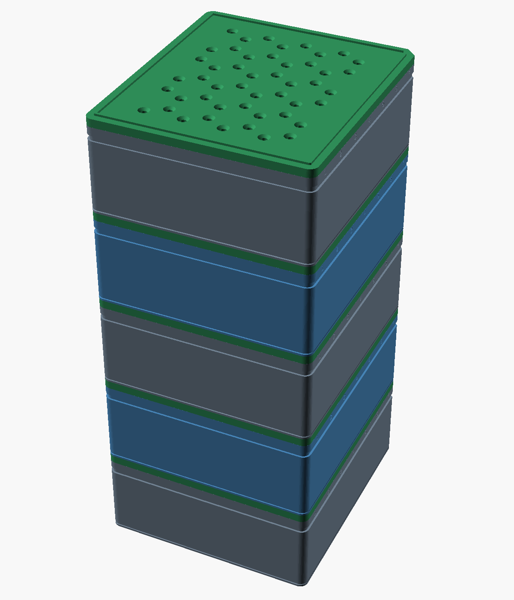
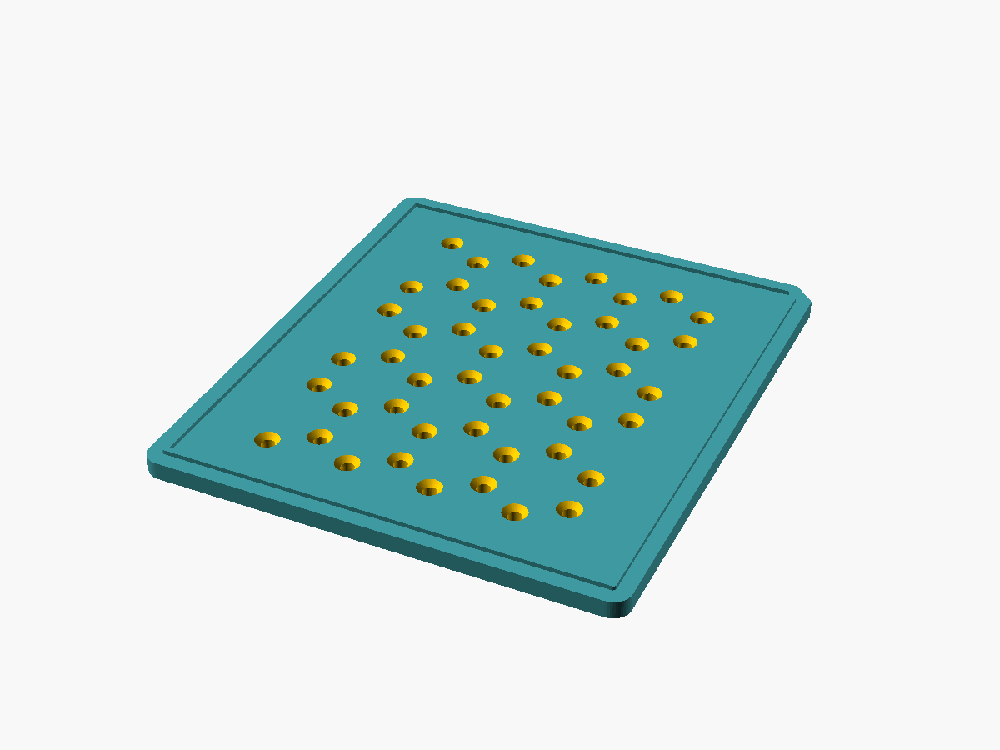
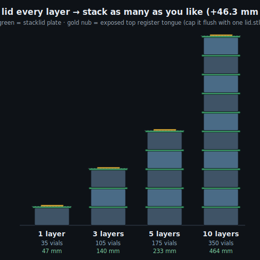
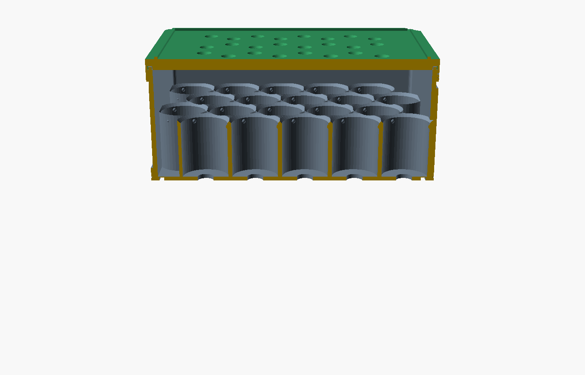

# Lidded-stack variant (v6) — modular, inboard keyed registers

A separate, opt-in variant of the [sleeveless tray tower](../README.md). **Every tray
gets its own identical lid** (`stacklid`) and the tower stacks `tray → lid → tray → …`
— **fully modular: stack as many layers as you like, add more any time.**

## v6 — register redesign (fixes a real v5 defect)

A geometry review of the v5 STLs found that the **"lighter frame" trim (rim 3.0→2.5 mm)
made the perimeter register groove (2.8 mm wide) wider than the rim itself**. Mesh
slices proved the cut severed the frame's bottom 3.4 mm: the tray's outer wall floated
1.8 mm above the floor, printed as a full-perimeter overhang over air, and the groove
had no walls left. The stacklid's matching cut left its register tongue standing on a
0.6 mm cantilever lip. Two cups per long side were also gutted by the finger scallops,
and the engraved IDs dipped into the snap-detent recess (chopped glyph bottoms).

v6 fixes all of it at the root:

1. **Inboard keyed registers** — a walled groove cannot live in a ≤3 mm rim, so both
   register interfaces moved inboard into solid material:
   - **A (lid on tray):** tray-top tongue (1.2 × 1.2 mm, inset 1.0 on the rim) seats in
     a walled slot in the lid/stacklid **underside plate** (cap over slot: 2.6 mm, vs
     0.6 mm in v4/v5).
   - **B (tray on stacklid):** stacklid-top tongue (1.2 × 1.0 mm, inset 3.3) seats in a
     walled slot in the tray **floor underside** (0.4 mm cap bridges the 1.8 mm slot —
     trivial bridge; the rim now prints solid from the bed up).
   - **True orientation key:** each tongue has a 45° corner flat and each slot a matching
     corner **block** — a 180°-rotated part hits ~1 mm of solid interference and cannot
     seat (boolean-verified in OpenSCAD).
2. **Finger scallops removed** — vestigial from the v3 solid cup block; against the v5
   open frame they cut through the frame **and through the bore of 4 cups**. Grip is the
   full 42 mm exposed side walls once the layer above is lifted off.
3. **Engraved IDs raised** (`tray_h−3.6 → −2.2`) — clear of the detent recess by 0.5 mm,
   so A–E / 1–7 print whole.
4. **Audit hardening** — `checks_lidded.py` now **parses the live `.scad` and fails on
   param drift** (the v5 bug passed the old checks because they still mirrored v4
   params). New assertions: slot walls exist, caps printable, no perimeter cut below the
   floor, rotation key engaged, drains clear the tongue ring.

Carried over from v5: skirtless drain-plate stacklid (prints plate-on-bed, support-free),
engraved IDs + label recess, lighter frame (rim 2.5 / floor 1.6), retention nubs
(~0.2 mm) so vials don't fall from a lifted tray.

Footprint **106 × 119 mm**. All parts render manifold; `fit_audit.py` +
`checks_lidded.py` pass; all five mating interfaces boolean-verified collision-free
(and the rotated-tray case verified to **collide**, which is the point).

| Tower (5 layers — stack any number) | Stacklid (drain holes + register tongue) |
|---|---|
|  |  |

## Stack any height (the modular part)
Every lid is a `stacklid`, so each `(tray + stacklid)` unit is a repeatable module.
`LAYERS` in `vial_trays_lidded.scad` only drives the preview/height math — **the
printed parts don't change**; you just print one more `tray` + one more `stacklid`
for each extra layer.



| Layers | Vials | Height (extendable) | Height (flush cap) |
|---:|---:|---:|---:|
| 1 | 35 | 47.3 mm | 46.3 mm |
| 2 | 70 | 93.7 mm | 92.7 mm |
| **3** | **105** | **140.0 mm** | **139.0 mm** |
| 5 | 175 | 232.7 mm | 231.7 mm |
| 10 | 350 | 464.4 mm | 463.4 mm |

Footprint stays **106 × 119 mm** at any height. Per-layer pitch is a constant
**46.34 mm** (tray 42.34 + lid plate 4.0); the inter-layer tongues recess into the
slots and add nothing. The exposed top tongue adds just 1.0 mm (vs 3.0 in v5).

### Why the topmost lid used to be different — and isn't anymore
Earlier the top layer used a plain `lid()` (no top tongue) so the very top finished
flush. But a plain lid has nothing for the next tray to seat on, so you **couldn't
extend the stack**. Now every lid is a `stacklid`; the **topmost** one simply leaves
its register tongue **exposed** (a 1.2 mm-wide, 1.0 mm-tall inboard ring). It's
harmless and means you can always stack another module on top. When you've settled on
a final height and want a clean flush top, set `FLUSH_TOP=true` (or just print **one**
`lid.stl`) to cap the very top — but then that cap can't be stacked on.

## Why the per-layer cost is small
The top-cap lid skirt **telescopes down over the tray** (overlap = zero added height),
so each added layer costs only the 4 mm lid plate on top of the tray it caps. Verified
by `checks_lidded.py` and by rendering all three parts manifold in OpenSCAD.

## Directed drainage
The lids carry **48 × Ø3 mm holes** placed on the hex **interstices** (the centroids
between every 3 cups). They clear the vials below by ~1 mm, so meltwater is routed
**between** the vials and never drips onto a crimp/septum. Disable with
`-D lid_drain=false`.

## Fit & geometry verification (v6)
- `fit_audit.py` — every mating interface with real numbers (snap, both registers,
  inter-layer clearance, vial/drain, printability). ALL PASS.
- `checks_lidded.py` — design-rule checks **+ param-drift guard against the live scad**.
- OpenSCAD boolean interference tests: stacklid-on-tray, tray-on-stacklid, lid-on-tray,
  vials-vs-plate-above → all empty (no collision); **rotated tray → 0.99 mm collision**
  (orientation key works).
- Mesh z-slices: tray cross-section is full footprint from z=0 up (v5 was missing its
  entire perimeter below z=3.4).



## Print recipe (modular)
For an **N-layer** tower:

| Part | Qty | File |
|---|---|---|
| tray | **N** | `tray.stl` |
| lid (universal) | **N** | `stacklid.stl` |
| flush top cap | 0 or 1 | `lid.stl` *(optional — only if you want a flush, non-extendable top)* |

So the default 3-layer tower = **3 × tray + 3 × stacklid** (+ optional 1 × `lid`).
PETG (freezer-tough), flat, no supports, 0.4 mm nozzle, 3 perimeters.

## SHRINK toggle (height vs stiffness)
The v6 underside slot is only 1.4 mm deep, so the lid plate is no longer pinned at
4.0 mm by a fragile cap. `SHRINK=true` thins it to **3.0 mm** (cap over slot still
1.6 mm — fine) and shortens the tower by 3 mm per 3 layers. Default `false` keeps the
stiffer 4.0 plate.

> The bigger lever for a shorter tower is a **recessed lid** (drop the plate into the
> 3 mm vial clearance) — not built here yet.

## Render / verify
```bash
python3 checks_lidded.py     # includes the param-drift guard vs the .scad
python3 fit_audit.py
openscad -o stacklid.stl --export-format=binstl lidded_stacklid_part.scad   # universal lid
openscad -o tray.stl     --export-format=binstl lidded_tray_part.scad
openscad -o lid.stl      --export-format=binstl lidded_toplid_part.scad     # optional flush cap
# preview a taller tower: render the assembly with any LAYERS
openscad -o tower.png --render -D LAYERS=5 lidded_assembly_part.scad
```

> ⚠️ Verified in software + manifold renders. Print **one tray + one stacklid** first
> to test the lid snap, the tray-on-lid seat, the rotation key, and the drain spacing,
> then stack the rest.
