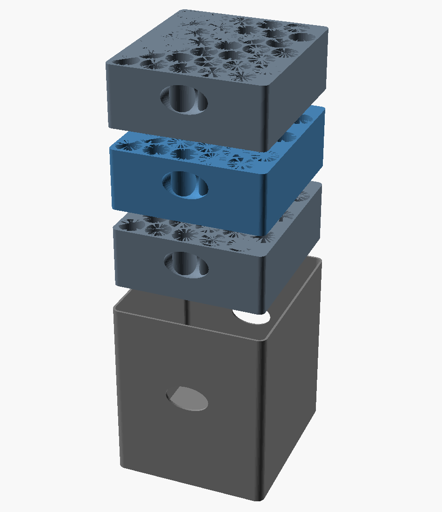

# 100× 3 mL Vials — Individual-Holder Stacking Trays

Redesign of the [near-cube container](../README.md) under one new rule: **every vial gets its own individual pocket** — no vials stacked on top of each other inside a shared tube.



## Design

- **3 identical trays**, each a 5 × 7 hex grid of **35 individual blind pockets** (105 total, 100 vials + 5 spare).
- Every vial sits in its **own pocket on its own floor** — never bearing another vial.
- Trays drop into a thin **sleeve** that registers them laterally and forms the outer near-cube; optional **lid** keeps freezer frost out.
- **Finger scallops** on the long sides to lift trays (and pinch vials) out.

| | |
|---|---|
| **Vial** | Ø16.51 × 37.74 mm (standard 3 mL serum vial) |
| **Assembled envelope** | **107 × 120 × 126 mm** (near-cube, aspect 1.18) |
| **Parts to print** | `tray.stl` ×3, `sleeve.stl` ×1, `lid.stl` ×1 (optional) |
| **Walls** | 1.5 mm |

## Print

- **Trays & lid:** flat on the plate, pockets up → no supports.
- **Sleeve:** open-end up → no supports.
- PETG (freezer-friendly) or PLA, 0.4 mm nozzle, 3 perimeters.
- Print **one tray first** as a fit-test with your real vials, then run the other two.

## Files

| File | Purpose |
|---|---|
| `vial_trays.scad` | Parametric source (tray / sleeve / lid / assembly) |
| `tray.stl` / `sleeve.stl` / `lid.stl` | Print files |
| `*_part.scad` | Wrappers that select which part to render |
| `assembly.png` / `tray.png` / `exploded.png` | Renders |

## Tuning

Edit the top of `vial_trays.scad`, then per part:

```bash
openscad -o tray.stl --export-format=binstl tray_part.scad
```

- `bore_clear` — vial fit; `cols`/`rows` — grid; `clr` — tray-in-sleeve slide fit.

> Note: render each part via its `*_part.scad` wrapper. The dispatcher uses a read-only
> `part_sel` selector — do **not** re-assign `PART` inside the file, or OpenSCAD's
> last-assignment hoisting silently renders the default part for every wrapper.

> ⚠️ Verified in software (all parts render clean & manifold). Measure your vials and
> print one tray before committing.
