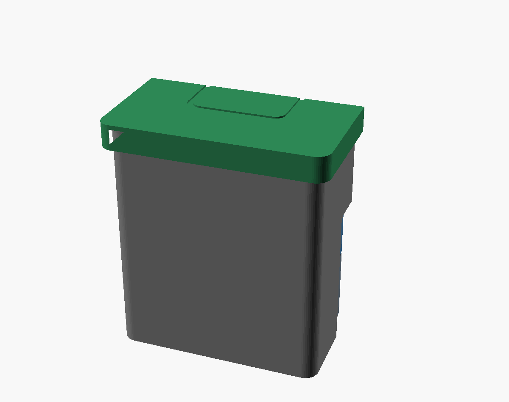

# 100× 3 mL Vials — Sleeveless Interlocking Tray Tower (v3)

Open/vented, freezer-friendly, **cheap to print**. Each vial in its own cup; three identical 5×7 hex trays interlock via tongue/groove into a self-stacking tower; a snap lid clips onto the top tray. **No sleeve.**

> 🧪 **Variant:** [`lidded/`](lidded/) — a **modular** test version where **every tray gets its own identical lid** and the tower stacks lid-to-lid, with directed drain perforations. Stack any number of layers (+46.74 mm each); footprint unchanged.



| | |
|---|---|
| **Vial** | Ø16.51 × 37.74 mm (standard 3 mL serum vial) |
| **Tower envelope** | **107 × 120 × 132 mm** (~114×127 incl. lid skirt; near-cube) |
| **Print** | `tray.stl` ×3, `lid.stl` ×1 |
| **Filament** | **~405 cm³ ≈ 514 g PETG** (down 51% from the v2 solid+sleeve design) |
| **Verified** | `checks.py` (17 checks) + both parts render manifold |

## Why no sleeve
The sleeve was a third of the filament *and* the reason the bottom layer was hard to reach. The trays interlock on their own, so:
- **Bottom-layer access** = just lift the stack apart (slip-fit grooves).
- **Open/vented** — no moisture trap; meltwater drains through the pocket relief holes. Your vials are sealed (crimp + septum), so the container never needs to seal the powder.

## Material — print in PETG or PP, NOT PLA
At freezer temps PLA goes brittle (and it's hygroscopic) — the snap lid and tongue/groove could crack. **PETG** (freezer-tough, printable) is the default; **PP** is ideal if your printer handles it.
- All parts print **flat, no supports**, on a cheap 220 mm bed.
- 0.4 mm nozzle, 3 perimeters.

## Features (v1→v3 evolution)
Individual cups (own floor) · **vial height clearance 3 mm** · **tongue/groove interlock** (anti-shift, lift-apart) · **snap lid** onto top tray · pocket lead-in chamfers · **relief/push hole** per cup (poke a vial out, frost drains) · corner key (one orientation) · finger scallops · lid grip recess · **thin-wall tube honeycomb** + **short cups** (open above) for minimal plastic · `checks.py` dimensional verification.

## Files

| File | Purpose |
|---|---|
| `vial_trays.scad` | Parametric source (tray / lid / assembly) |
| `tray.stl` ×3, `lid.stl` ×1 | Print files |
| `checks.py` | 17 dimensional checks |
| `*_part.scad` | Render wrappers |
| `assembly.png` / `cutaway.png` / `tray.png` / `lid.png` | Renders |

## Tuning

```bash
python3 checks.py
openscad -o tray.stl --export-format=binstl tray_part.scad
```

Key params: `bore_clear` (vial fit), `pocket_wall_h` (cup depth), `cup_wall`, `reg_clr` (tray stack fit), `catch_step` (lid snap), `v_clear`.

> Render each part via its `*_part.scad` wrapper. The dispatcher uses a read-only
> `part_sel` selector — never re-assign `PART`, or OpenSCAD's last-assignment hoisting
> silently renders the default part.

> ⚠️ Verified in software. Print **one tray + the lid** first to test the tray-to-tray
> groove fit and the lid snap, tune `reg_clr` / `catch_step` / `bore_clear`, then run the rest.
