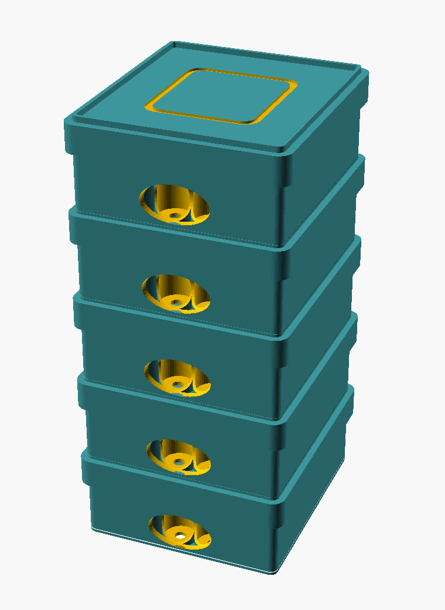
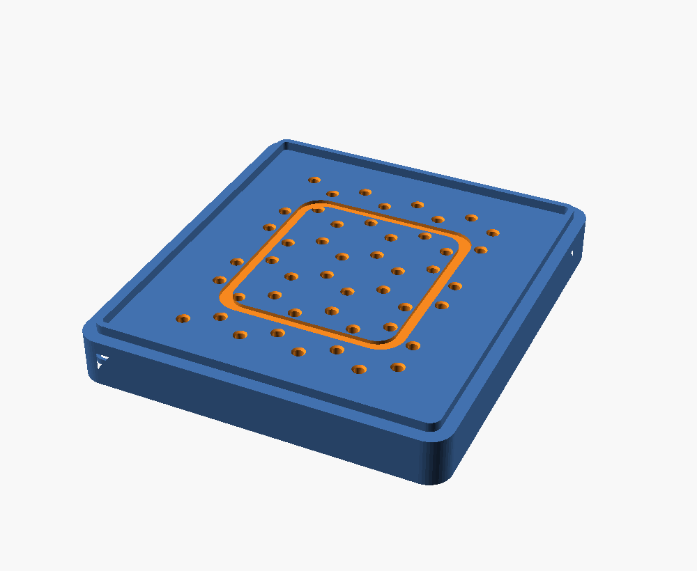
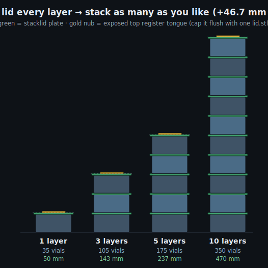
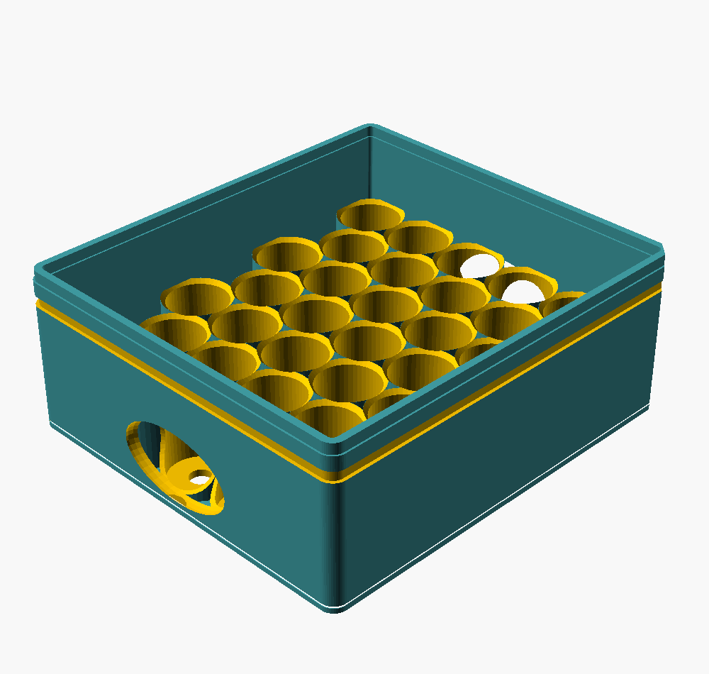

# Lidded-stack variant (v4-lidded) — modular TEST VERSION

A separate, opt-in variant of the [sleeveless tray tower](../README.md). Instead of
the trays interlocking **directly** (tongue→groove, one lid on top), **every tray
gets its own identical lid** (`stacklid`) and the tower stacks
`tray → lid → tray → lid → …`. Each layer is a self-contained, snap-closed,
liftable module — and because every lid is the same, the tower is **fully modular:
stack as many layers as you like and add more any time.**

| Tower (5 layers — stack any number) | Stacklid (drain holes + register tongue) |
|---|---|
|  |  |

| | v3 sleeveless | **v4 lidded (modular)** |
|---|---|---|
| Lids | 1 (top only) | **1 identical `stacklid` per tray** |
| Stacks via | tray-on-tray groove | **lid top plate** (register tongue) |
| Max height | fixed 3-tray tower | **unlimited** — add a layer = +46.74 mm |
| 3-layer envelope | 107 × 120 × **132** mm | 107 × 120 × **143** mm (or **140** flush) |
| Drainage | relief holes drain down | **directed lid perforations** (see below) |

## Stack any height (the modular part)
Every lid is a `stacklid`, so each `(tray + stacklid)` unit is a repeatable module.
`LAYERS` in `vial_trays_lidded.scad` only drives the preview/height math — **the
printed parts don't change**; you just print one more `tray` + one more `stacklid`
for each extra layer.



| Layers | Vials | Height (extendable) | Height (flush cap) |
|---:|---:|---:|---:|
| 1 | 35 | 49.7 mm | 46.7 mm |
| 2 | 70 | 96.5 mm | 93.5 mm |
| **3** | **105** | **143.2 mm** | **140.2 mm** |
| 5 | 175 | 236.7 mm | 233.7 mm |
| 10 | 350 | 470.4 mm | 467.4 mm |

Footprint stays **107 × 120 mm** at any height. Per-layer pitch is a constant
**46.74 mm** (tray 42.74 + lid plate 4.0); the inter-layer tongues recess into the
grooves and add nothing.

### Why the topmost lid used to be different — and isn't anymore
Earlier the top layer used a plain `lid()` (no top tongue) so the very top finished
flush. But a plain lid has nothing for the next tray to seat on, so you **couldn't
extend the stack**. Now every lid is a `stacklid`; the **topmost** one simply leaves
its register tongue **exposed** (a 2 mm-wide, 3 mm-tall ring — that's the +3 mm vs
the flush column above). It's harmless and means you can always stack another module
on top. When you've settled on a final height and want a clean flush top, set
`FLUSH_TOP=true` (or just print **one** `lid.stl`) to cap the very top — but then
that cap can't be stacked on.

## Why the per-layer cost is small
The lid skirt **telescopes down over the tray** (overlap = zero added height), so
each added layer costs only the 4 mm lid plate on top of the tray it caps. Verified
by `checks_lidded.py` and by rendering all three parts manifold in OpenSCAD.

## Directed drainage
The lids carry **48 × Ø3 mm holes** placed on the hex **interstices** (the centroids
between every 3 cups). They clear the vials below by ~1 mm, so meltwater is routed
**between** the vials and never drips onto a crimp/septum. Disable with
`-D lid_drain=false`.

## What changed vs v3
- `tray()` is the v3 tray with the **+x/+y corner closed**: the old corner-key
  *through-notch* cut a 45° cube wider than the 3 mm rim, slicing the corner
  open. It's now a clean 45° **chamfer** (closed wall, still a one-orientation
  marker). So the lidded tray no longer matches the stock `../tray.stl`.
- New `stacklid()` = the v3 lid + a register tongue on top, so the next tray's
  existing bottom groove seats on it (recessed → no extra pitch). It's the
  **universal** lid — print one per tray.
- `lid()` (no top tongue) is kept only as an **optional flush cap** for the very top.

## Fit & geometry hardening
Validated every mating interface with `fit_audit.py` (snap, stacking seat, inter-
layer clearance, vial/drain, printability) and tightened a few:
- **Corner** — closed (chamfer), matched on tray + lid + tongue for a consistent key.
- **Snap** — detent 3.0 → 2.6 mm (0.6 mm play, not 1.0) for a crisper click; added
  a skirt-mouth lead-in so the lid starts over the rim easily.
- **Drainage** — drain funnel 0.6 → 1.2 mm for better surface-water capture.
- **Lid fit protected** — the lid's outer corners stay **rounded** (its proven
  snap/skirt geometry is untouched); only the tray corner is keyed. The snap
  still engages ~98% of the rim and seats on a flush positive stop.
- All interfaces PASS (`fit_audit.py`); all three parts re-render manifold.



## Print recipe (modular)
For an **N-layer** tower:

| Part | Qty | File |
|---|---|---|
| tray | **N** | `tray.stl` (v3 tray + closed corner — print this one, not stock) |
| lid (universal) | **N** | `stacklid.stl` |
| flush top cap | 0 or 1 | `lid.stl` *(optional — only if you want a flush, non-extendable top)* |

So the default 3-layer tower = **3 × tray + 3 × stacklid** (+ optional 1 × `lid`).
PETG (freezer-tough), flat, no supports, 0.4 mm nozzle, 3 perimeters.

## SHRINK toggle (height vs robustness)
`lid_top_t` is already near its floor: the underside register groove (3.4 mm deep)
leaves only a ~0.6 mm cap, so naively thinning the plate makes **that cap brittle
in the freezer**. Set `SHRINK=true` to shave the plate **and** the register depth
together (`lid_top_t 4→3.5`, `reg_h 3→2.5`); the cap stays ~0.6 mm (not more
fragile) and the per-layer pitch drops by 0.5 mm. Trade-off: the tongue drops to
2.5 mm, so the lidded tray no longer matches the stock `tray.stl` — print this
variant's own `tray.stl`. Default is `false`.

> The real lever for a shorter tower is a **recessed lid** (drop the plate into the
> 3 mm vial clearance), not a thinner plate — not built here yet.

## Render / verify
```bash
python3 checks_lidded.py
openscad -o stacklid.stl --export-format=binstl lidded_stacklid_part.scad   # universal lid
openscad -o tray.stl     --export-format=binstl lidded_tray_part.scad
openscad -o lid.stl      --export-format=binstl lidded_toplid_part.scad     # optional flush cap
# preview a taller tower: render the assembly with any LAYERS
openscad -o tower.png --render -D LAYERS=5 lidded_assembly_part.scad
```

> ⚠️ Verified in software + manifold renders. Print **one tray + one stacklid** first
> to test the lid snap, the tray-on-lid seat, and the drain spacing, then stack the rest.
