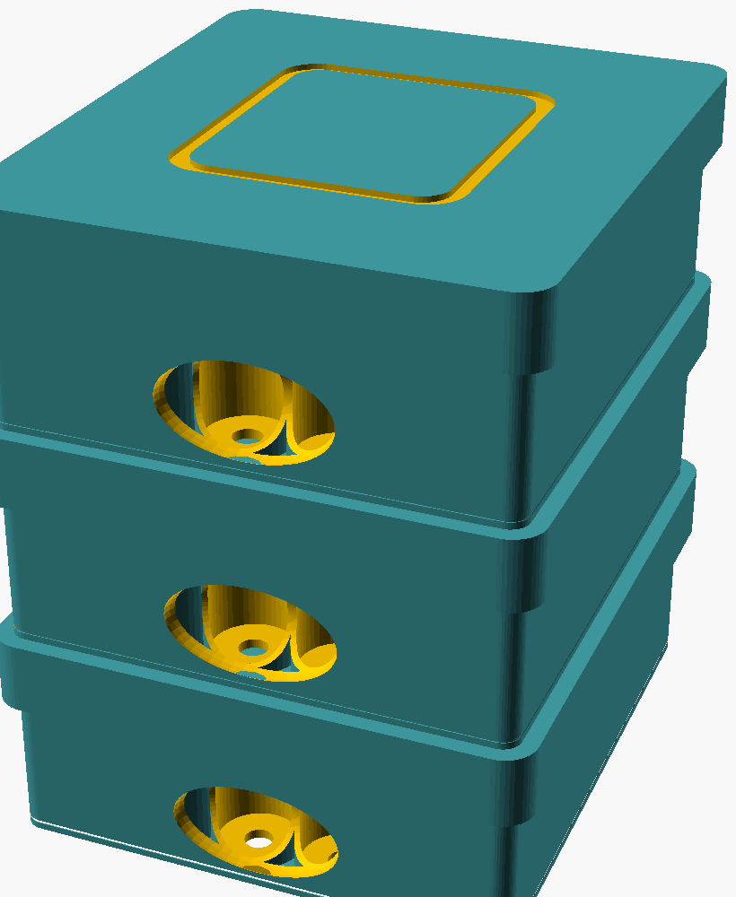

# Lidded-stack variant (v4-lidded) — TEST VERSION

A separate, opt-in variant of the [sleeveless tray tower](../README.md). Instead of
the trays interlocking **directly** (tongue→groove, one lid on top), **every tray
gets its own lid** and the tower stacks `tray → lid → tray → lid → tray → lid`.
Each layer becomes an independently snap-closed, liftable module.

| Tower (3 trays + 3 lids) | Stacklid (drain holes + register tongue) |
|---|---|
|  |  |

| | v3 sleeveless | **v4 lidded** |
|---|---|---|
| Lids | 1 (top only) | **3 (one per tray)** |
| Stacks via | tray-on-tray groove | **lid top plate** |
| Envelope | 107 × 120 × **132** mm | 107 × 120 × **140** mm |
| Height delta | — | **+8 mm (+6%)**, footprint unchanged |
| Drainage | relief holes drain straight down | **directed lid perforations** (see below) |

## Why it's only +8 mm
The lid skirt **telescopes down over the tray** (overlap = zero added height), so
each extra lid costs only its 4 mm top plate. Going from 1 lid → 3 lids = **+2
plates = +8 mm**. Verified by `checks_lidded.py` and by rendering all three parts
manifold in OpenSCAD.

## What changed vs v3 (minimal)
- `tray()` is **unchanged** — reuses the stock `../tray.stl` (when `SHRINK=false`).
- The lid gains a **register tongue on top** (`stacklid()`) so the next tray's
  existing bottom groove seats on it. No extra pitch — the tongue recesses into
  the groove.
- The lids gain **directed drain holes**: 48 × Ø3 mm holes placed on the hex
  **interstices** (the centroids between every 3 cups). They clear the vials
  below by ~1 mm, so meltwater is routed **between** the vials and never drips
  onto a crimp/septum. Disable with `-D lid_drain=false`.

## Print recipe
| Part | Qty | File |
|---|---|---|
| tray | 3 | `tray.stl` (identical to the stock `../tray.stl`) |
| intermediate lid | 2 | `stacklid.stl` |
| top lid | 1 | `lid.stl` |

PETG (freezer-tough), flat, no supports, 0.4 mm nozzle, 3 perimeters. Filament
is roughly **+15–20% vs v3** for the two extra lids.

## SHRINK toggle (height vs robustness)
`lid_top_t` is already near its floor: the underside register groove (3.4 mm deep)
leaves only a ~0.6 mm cap, so naively thinning the plate makes **that cap brittle
in the freezer** — exactly what you don't want. Set `SHRINK=true` to shave the
plate **and** the register depth together (`lid_top_t 4→3.5`, `reg_h 3→2.5`); the
cap stays ~0.6 mm (not more fragile) and the tower drops to **138.7 mm (+6.5)**.
Trade-off: the tongue drops to 2.5 mm, so the lidded tray no longer matches the
stock `tray.stl` — print this variant's own `tray.stl`. Default is `false`.

> The real lever for a shorter tower is a **recessed lid** (drop the plate into the
> 3 mm vial clearance), not a thinner plate — not built here yet.

## Render / verify
```bash
python3 checks_lidded.py
openscad -o stacklid.stl --export-format=binstl lidded_stacklid_part.scad
openscad -o lid.stl      --export-format=binstl lidded_toplid_part.scad
openscad -o tray.stl     --export-format=binstl lidded_tray_part.scad
```

> ⚠️ Verified in software + manifold renders. Print **one tray + one stacklid + the
> top lid** first to test the lid snap, the tray-on-lid seat, and the drain spacing,
> then run the rest.
